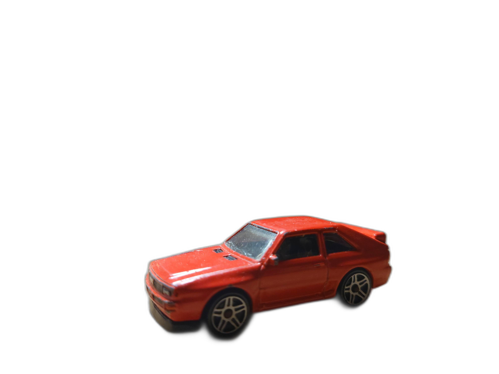

Rembg is a python library that allows you to remove backgrounds from images.

<!--more-->

...More about  <a href="https://github.com/danielgatis/rembg">Rembg</a>
___
## Install rembg library

```bash
pip install rembg
```
___

## Code
```python
from rembg import remove
from PIL import Image

inp_img = 'car1.JPG'
out_img = 'car1_out.png'

input = Image.open(inp_img)
output = remove(input)
output.save(out_img)
```

<table>
  <thead>
    <tr>
      <th>After</th>
      <th>Before</th>
    </tr>
  </thead>
  <tbody>
    <tr>
      <td></td>
      <td></td>
    </tr>
    <tr>
  </tbody>
</table>